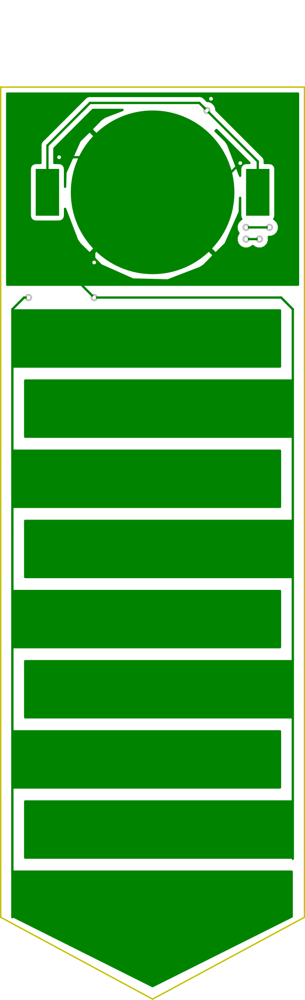

# soil-moisture-pcb
Capacitive soil moisture sensor routed in KiCad. Uses an Fastnel NRF52840 module, and is powered by a 3.0v coin cell battery.

## PCB Layout

| Front Copper                           | Back Copper |
| ----------------------------------------- | -----
|  |  |

